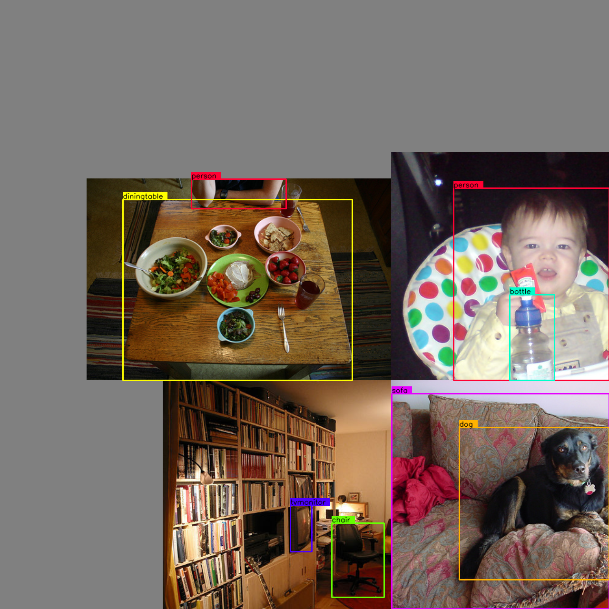
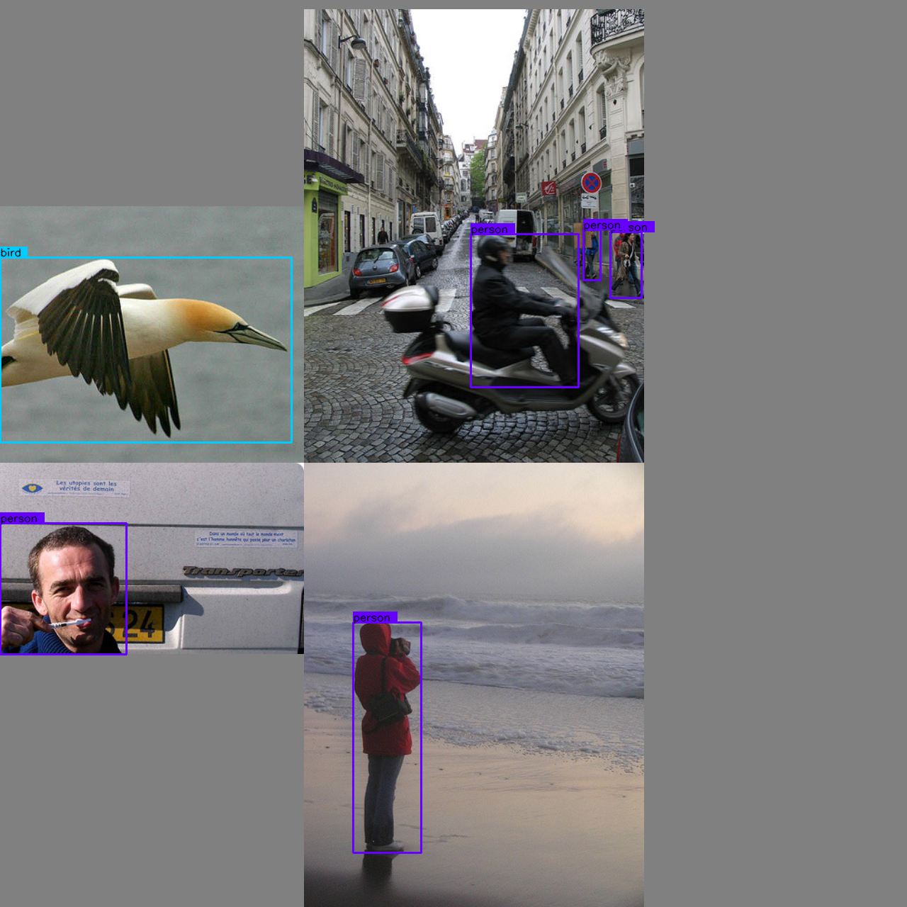
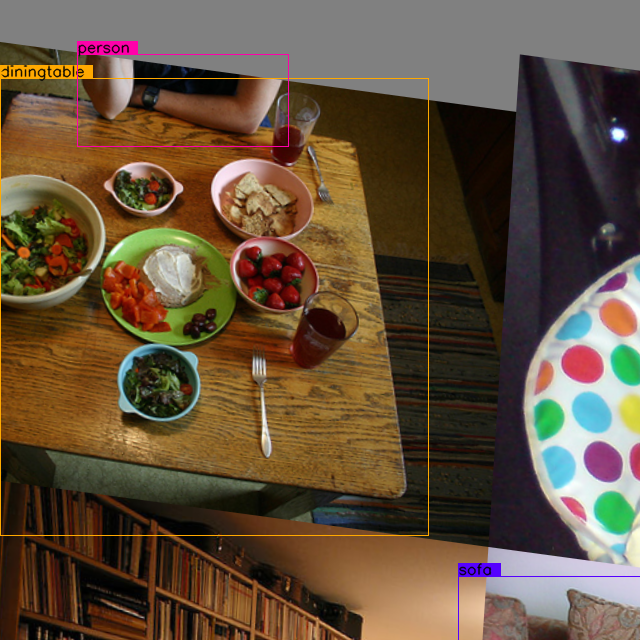

# tensorflow2-yolov5
YoloV5 implemented by TensorFlow2 , with support for training, evaluation and inference.


## Table of Contents
* [Data Preparation](#data-preparation)
* [Data Preprocess](#data-preprocess)
<!-- * [License](#license) -->

## Data Preparation

### Download VOC
```
$ bash preparation/get_voc.sh
```
### Generate txt file 
```
$ cd preparation
$ python prepare_data.py --class_name_dir '../preparation/voc.names' --output_dir '../preparation/txt_files/voc'
```

### Generate yolo anchors
```
$ cd preparation
$ python create_anchor.py 
```

## Data Preprocess

### 1. Load Mosaic Image

Examples:




### 2. Random perspective
Examples:



